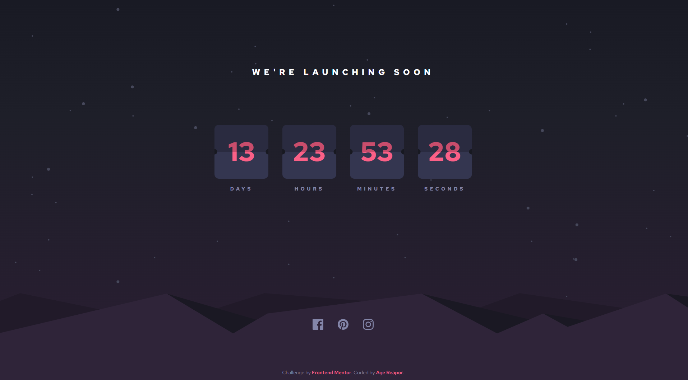

# Frontend Mentor - Launch countdown timer solution

This is a solution to the [Launch countdown timer challenge on Frontend Mentor](https://www.frontendmentor.io/challenges/launch-countdown-timer-N0XkGfyz-). Frontend Mentor challenges help you improve your coding skills by building realistic projects.

## Table of contents

- [Overview](#overview)
  - [The challenge](#the-challenge)
  - [Screenshot](#screenshot)
  - [Links](#links)
- [My process](#my-process)
  - [Built with](#built-with)
  - [What I learned](#what-i-learned)
  - [Continued development](#continued-development)
  - [Useful resources](#useful-resources)
- [Author](#author)

## Overview

### The challenge

Users should be able to:

- See hover states for all interactive elements on the page
- See a live countdown timer that ticks down every second (start the count at 14 days)
- **Bonus**: When a number changes, make the card flip from the middle

### Screenshot

### Links

- Solution URL: [Github](https://github.com/AgeReapor/launch-countdown-timer-v2)
- Live Site URL: [Add live site URL here](https://launch-countdown-timer-v2-kjhk1rgcp-agereapors-projects.vercel.app)

## My process

### Built with

- Semantic HTML5 markup
- [SCSS](https://sass-lang.com/) - CSS Preprocessor
- Flexbox
- Desktop-first workflow
- [React](https://reactjs.org/) - JS library
- [Typescript](https://www.typescriptlang.org/) - JS library
- [Vite](https://vitejs.dev/) - JS bundler

### What I learned

I did this Frontend Challenge in React to consolidate what I learned upon going through Full Stack Zack's [Javascript to React](https://youtu.be/BHsM7EBrH80) tutorial. In the process of this project I learned how to build a website with React components instead of just a plain HTML, as well as using useState and useEffect for state management.

In that video I also learned what and how bundlers work beyond surface understanding, and found myself using Vite as bundler instead of Webpack as was taught in the video. This is because have seen Vite used in group projects before, which I previously simply ignored as I was focused on isolated or utility scripts that I run with nodemon as the development server.

I also tested the waters with the SCSS preprocessor, which I came across to be helpful in harder CSS challenges I come across. As I was using Vite, this was easy to integrate.

Lastly, I found the hardest part of this challenge to be deploying the application on Vercel. A birthing pang with Vite, as I found Vercel to not correctly build the application as I did the usual Vercel deployment I do with other Frontend challenges. After several attempts at debugging or using alternatives like the Vercel CLI, Github pages and going back to Webpack, I decided to start an new Vite project from scratch, and deploy it immediately in Vercel. I then slowly moved the files from the first project to the new one, and finally I managed to deploy the full project.

### Continued development

As it was not provided, something that can be further developed in the future is to implement some event for when the countdown reaches zero apart from the countdown stopping. With how I've set the App component, it will be easy to add some functionality for when the countdown reaches zero, like changing the text message.

I can perhaps also add some functionality that lets one customize the countdown, perhaps setting it to other times or the ability to reset it.

### Useful resources

- [useLocalStorage hook](https://usehooks.com/uselocalstorage) - Used to save the countdown target in the browser
- [useEffect tutorial](https://youtu.be/0ZJgIjIuY7U) - Used to run the animations for the flip cards on value change
- [Full Stack Zack's Javascript to React](https://youtu.be/BHsM7EBrH80) - Taught me React and JS bundling.

## Author

- Github - [AgeReapor](https://github.com/AgeReapor)
- Frontend Mentor - [@AgeReapor](https://www.frontendmentor.io/profile/AgeReapor)
